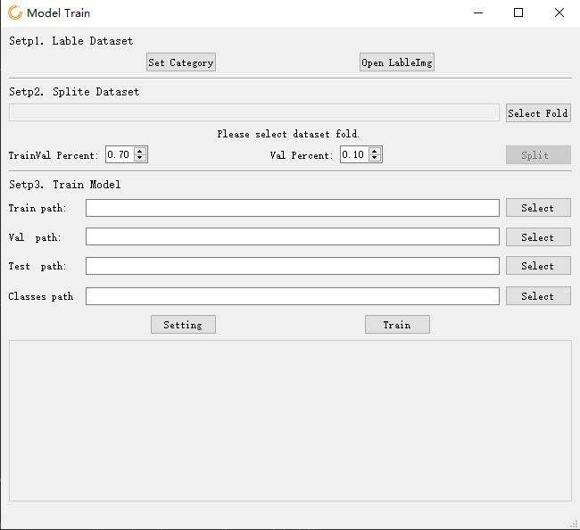
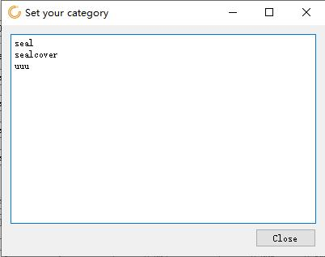

# Project description
This project should be used in conjunction with the [Cable_Defect_Detection](https://github.com/Riptide41/Cable_Defect_Detection) project, and is mainly used to train the original cable detection model used in the [Cable_Defect_Detection](https://github.com/Riptide41/Cable_Defect_Detection) project.
The project is based on the YOLOv5 object detection network, which integrates the steps required to train a object detection model, including three parts: label dataset, prepare dataset, and model training. In addition, the training parameters can be adjusted according to the actual situation to obtain a better detection model.

# Quick Start
The environment that the program depends on is similar to [Cable_Defect_Detection](https://github.com/Riptide41/Cable_Defect_Detection) project. When a python library is missing, you can use the "pip install XXX" command to install it.

After installation, run the main.py file under the project to display the main interface of the project, as shown in the figure.

## 1.Label picture

First, you can use software such as Pylon Viewer software to collect enough pictures (the picture format is required to be .jpg or .bmp),the number of pictures is preferably more than 100, and place the pictures in the same folder as a dataset.

Then click the "Set Category" button in the main interface of the software, enter all the categories used in the labeling in the pop-up interface, and separate each category with a carriage return. After inputting, click Close and select Save.

Click the "Open LabelImg" button to open the LabelImg program. The LabelImg software can be used to label pictures conveniently and quickly. After entering the program, click "Open DIr" to open the folder where the data set is located. After setting the save format to Yolo, you can start labeling. If there are problems in the use, please refer to the [LabelImg page](https://github.com/tzutalin/labelImg).

## 2.Prepare dataset

After all the pictures are labeled, click the "select fold" button in "Setp2" to select the folder of the dataset, and the software will detect the total number of pictures in the folder. Then, the proportion of train&valid set and test set is modified by "TrainVal percent", and the proportion of valid set in train&valid set is modified by ”Val percent".After modification, click the "split" button to split the train set, valid set and test set, and four files will be generated under the data set path, namely "train.txt", "val.txt", "test.txt", "classes.txt".

## 3.Train

Fill in the four file paths generated in the previous step in turn, then click the "setting" button to modify the parameters of the model training.

"Yolov5s" model will be used for training by default, if you need to use yolov5m / 5L / 5x model, you can go to the [yolov5 project](https://github.com/ultralytics/yolov5) page to download the pre training model, and then modify the weight parameter to the download model path. 

Click the “Change Hyperparameters” button to open the Hyperparameters modification page.

If you don't understand the meaning of the parameter, you can point the mouse at the label to prompt. If you still don't understand the meaning, it is recommended to keep the default.

After setting parameters, click training to start training, and the training process will be printed below. If the training needs to stop, just close the program.

If you need to train the model under the same dataset, you just need to perform the step3.

